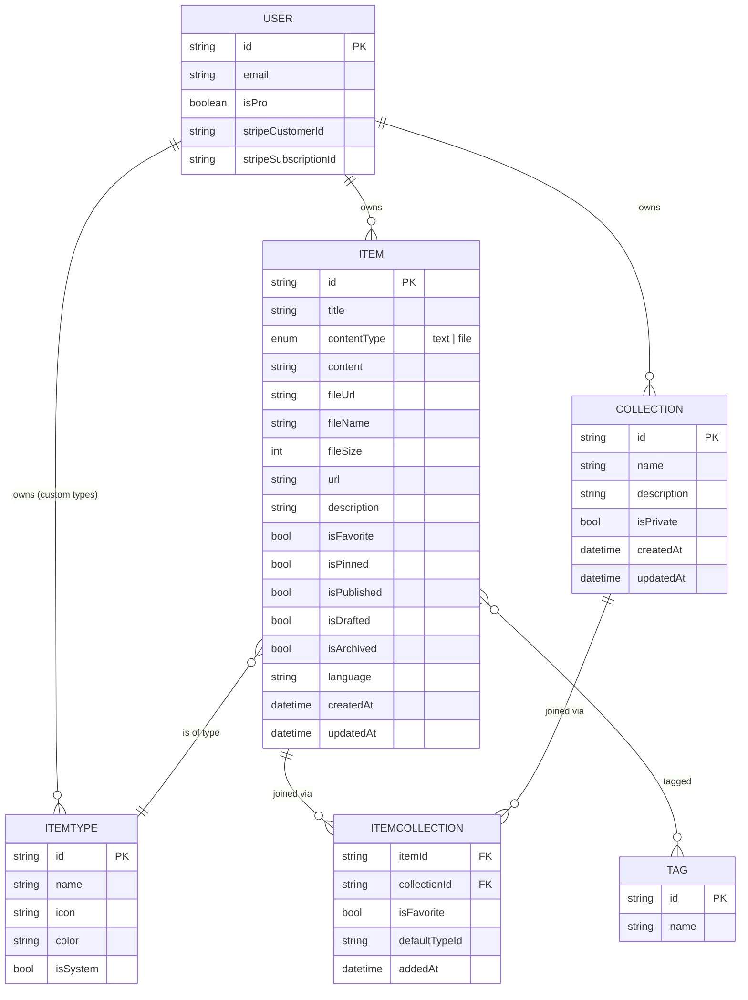

# 📓 DevNote — Project Overview

> A fast, searchable, AI-enhanced hub for everything a developer keeps scattered: snippets, prompts, commands, notes, links, and files.

---

## 📑 Table of Contents

1. [Problem](#-problem)
2. [Target Users](#-target-users)
3. [Features](#-features)
4. [Data Model](#-data-model)
5. [Tech Stack](#️-tech-stack)
6. [Monetization](#-monetization)
7. [UI/UX](#-uiux)
8. [Roadmap Notes](#-roadmap-notes)

---

## 🎯 Problem

Developers keep their essentials scattered across many tools, which creates context switching, lost knowledge, and inconsistent workflows.

| Asset | Typically Stored In |
|---|---|
| Code snippets | VS Code, Notion |
| AI prompts | ChatGPT/Claude chats |
| Context files | Buried in projects |
| Useful links | Browser bookmarks |
| Docs | Random folders |
| Commands | `.txt` files |
| Project templates | GitHub gists |
| Terminal commands | Bash history |

**DevNote consolidates all of this into ONE fast, searchable, AI-enhanced hub.**

---

## 👥 Target Users

| User | What They Need |
|---|---|
| 🧑‍💻 **Everyday Developer** | Fast way to grab snippets, prompts, commands, links |
| 🤖 **AI-first Developer** | Save prompts, contexts, workflows, system messages |
| 🎓 **Content Creator / Educator** | Store code blocks, explanations, course notes |
| 🛠 **Full-stack Builder** | Collect patterns, boilerplates, API examples |

---

## ✨ Features

### A. Items & Item Types

Items are the atomic unit of DevNote. Every item belongs to a **type**.

**Visibility states** (per item):
- `published` + `public` → visible to all users
- `published` + `private` → visible only to owner
- `drafted` → only visible to owner (default on create)
- `archived` → only visible to owner

> Users can create **custom types** (Pro feature, later), but the following **system types** ship by default and cannot be modified:

| Type | Category | Color | Icon | Pro Only |
|---|---|---|---|---|
| `snippet` | text | `#3b82f6` 🔵 | `Code` | — |
| `prompt` | text | `#8b5cf6` 🟣 | `Sparkles` | — |
| `note` | text | `#fde047` 🟡 | `StickyNote` | — |
| `command` | text | `#f97316` 🟠 | `Terminal` | — |
| `link` | url | `#10b981` 🟢 | `Link` | — |
| `file` | file | `#6b7280` ⚪ | `File` | ✅ |
| `image` | file | `#ec4899` 🩷 | `Image` | ✅ |

**Routing convention:** `/items/{typeNamePlural}` → e.g. `/items/snippets`, `/items/prompts`

Items should be quick to access and create within a **slide-out drawer** (no full-page navigation required for create/edit/view).

---

### B. Collections

Users can group items into **collections**. An item can belong to **multiple collections** (many-to-many).

**Examples:**
- React Patterns *(snippets, notes)*
- Context Files *(files)*
- Python Snippets *(snippets)*
- Next.js *(snippets — drafted)*

#### Visibility & Privacy Rules

Collections have an `isPrivate` flag that **cascades to items inside them**, but with an escape hatch: an item stays public if it's *also* in a public collection.

**Effective visibility of an item is:**

```
item is visible to others   ⇔   item.isPublished == true
                              AND ( item has no collections
                                    OR item belongs to ≥1 public collection )
```

| Scenario | Item visible to others? |
|---|---|
| `isPublished=true`, in 0 collections | ✅ yes |
| `isPublished=true`, in 1 public collection | ✅ yes |
| `isPublished=true`, in 1 private collection | ❌ no |
| `isPublished=true`, in 1 public + 1 private collection | ✅ yes *(public wins)* |
| `isPublished=false`, anywhere | ❌ no *(drafted)* |
| `isArchived=true`, anywhere | ❌ no *(archived)* |

**State transitions:**

- 🔒 **Collection flipped public → private:** every item inside becomes private, **except** items that also belong to another public collection (those stay public).
- 🔓 **Collection flipped private → public:** items inside become visible again (if `isPublished=true` and not archived).
- ➕ **Adding a public item to a private collection:** the item stays public as long as it's also in some other public collection. If this is the item's only collection, it effectively becomes private.
- ➖ **Removing an item from a private collection:** if no other private collections hold it, the item returns to following its own `isPublished`/`isArchived` state.
- ✏️ **User toggles `isPublished` to false:** item becomes a draft regardless of collection membership.

> 💡 The user **cannot** override collection-cascade privacy by toggling `isPublished=true` on an item that lives only in private collections. The only way to make such an item public is to **add it to a public collection** or **remove it from the private one(s)**.

---

### C. Search

Powerful search across:
- 🔎 Content
- 🏷 Tags
- 📛 Titles
- 🗂 Types

---

### D. Authentication

- Email + password
- GitHub OAuth

Powered by **NextAuth v5**.

---

### E. Other Features

- ⭐ Favorites (collections + items)
- 📌 Pin items to top
- 🕒 Recently used
- 📥 Import code from a file
- 📝 Markdown editor for text types
- 📤 File upload for `file` / `image` types
- 📦 Export data as multiple formats (JSON / ZIP)
- 🌙 Dark mode (default for devs)
- ➕ Add / remove items to/from multiple collections
- 👁 View which collections an item belongs to
- 🔒 Make a collection public/private
- 🗃 Mark items as published / drafted / archived

---

### F. AI Features 💎 *(Pro only)*

- 🏷 AI auto-tag suggestions
- 📝 AI summaries
- 💡 AI "Explain This Code"
- ✨ Prompt optimizer

Powered by **OpenAI `gpt-5-nano`**.

---

## 🧬 Data Model

### Entity Relationship Diagram



> 📌 **Privacy lives on `Collection`**, not the join table. Item-level visibility is *derived* from the union of its collections' `isPrivate` flags + the item's own `isPublished`/`isArchived` state. See [Visibility & Privacy Rules](#visibility--privacy-rules).

---

### Prisma Schema (Draft)

```prisma
// prisma/schema.prisma

generator client {
  provider = "prisma-client-js"
}

datasource db {
  provider = "postgresql"
  url      = env("DATABASE_URL")
}

// ─────────────────────────────────────────────
// USER (extends NextAuth)
// ─────────────────────────────────────────────
model User {
  id                   String   @id @default(cuid())
  name                 String?
  email                String   @unique
  emailVerified        DateTime?
  image                String?

  // Billing
  isPro                Boolean  @default(false)
  stripeCustomerId     String?  @unique
  stripeSubscriptionId String?  @unique

  // Relations
  items                Item[]
  collections          Collection[]
  customTypes          ItemType[]
  accounts             Account[]  // NextAuth
  sessions             Session[]  // NextAuth

  createdAt            DateTime @default(now())
  updatedAt            DateTime @updatedAt
}

// ─────────────────────────────────────────────
// ITEM
// ─────────────────────────────────────────────
enum ContentType {
  TEXT
  FILE
}

model Item {
  id          String      @id @default(cuid())
  title       String
  description String?

  contentType ContentType @default(TEXT)
  content     String?     @db.Text  // text content (null if file)
  fileUrl     String?                // R2 URL (null if text)
  fileName    String?
  fileSize    Int?                   // bytes
  url         String?                // for `link` type
  language    String?                // optional, for code highlighting

  // State flags
  // NOTE: effective public visibility = isPublished
  //       AND NOT isArchived
  //       AND (no collections OR ≥1 public collection)
  // See "Visibility & Privacy Rules" in the overview.
  isFavorite  Boolean     @default(false)
  isPinned    Boolean     @default(false)
  isPublished Boolean     @default(false)
  isDrafted   Boolean     @default(true)
  isArchived  Boolean     @default(false)

  // Relations
  userId      String
  user        User        @relation(fields: [userId], references: [id], onDelete: Cascade)

  itemTypeId  String
  itemType    ItemType    @relation(fields: [itemTypeId], references: [id])

  collections ItemCollection[]
  tags        Tag[]       @relation("ItemTags")

  createdAt   DateTime    @default(now())
  updatedAt   DateTime    @updatedAt

  @@index([userId])
  @@index([itemTypeId])
  @@index([isPublished, isArchived, isDrafted])
}

// ─────────────────────────────────────────────
// ITEM TYPE
// ─────────────────────────────────────────────
model ItemType {
  id        String   @id @default(cuid())
  name      String   // "snippet", "prompt", ...
  icon      String   // lucide icon name
  color     String   // hex color
  isSystem  Boolean  @default(false)

  // null for system types
  userId    String?
  user      User?    @relation(fields: [userId], references: [id], onDelete: Cascade)

  items     Item[]

  createdAt DateTime @default(now())
  updatedAt DateTime @updatedAt

  @@unique([userId, name])
}

// ─────────────────────────────────────────────
// COLLECTION
// ─────────────────────────────────────────────
model Collection {
  id          String   @id @default(cuid())
  name        String
  description String?
  isPrivate   Boolean  @default(false)

  userId      String
  user        User     @relation(fields: [userId], references: [id], onDelete: Cascade)

  items       ItemCollection[]

  createdAt   DateTime @default(now())
  updatedAt   DateTime @updatedAt

  @@index([userId])
}

// ─────────────────────────────────────────────
// ITEM ↔ COLLECTION (join)
// ─────────────────────────────────────────────
model ItemCollection {
  itemId        String
  item          Item       @relation(fields: [itemId], references: [id], onDelete: Cascade)

  collectionId  String
  collection    Collection @relation(fields: [collectionId], references: [id], onDelete: Cascade)

  isFavorite    Boolean    @default(false)
  defaultTypeId String?    // for new collections with no items yet
  addedAt       DateTime   @default(now())

  @@id([itemId, collectionId])
  @@index([collectionId])
}

// ─────────────────────────────────────────────
// TAG
// ─────────────────────────────────────────────
model Tag {
  id    String @id @default(cuid())
  name  String @unique
  items Item[] @relation("ItemTags")
}
```

> 🚨 **Migration policy:** **NEVER** use `prisma db push` or directly modify DB structure. All schema changes go through `prisma migrate dev` locally, then `prisma migrate deploy` in production.

---

## 🛠️ Tech Stack

### Framework
- **Next.js 16** + **React 19** — SSR pages with dynamic components
- API routes for backend (items, file uploads, AI calls)
- **TypeScript** for type safety
- Single repo / monorepo-style codebase for less overhead

### Database & ORM
- **Neon** — managed PostgreSQL in the cloud
- **Prisma 7** (latest) — fetch latest docs when scaffolding
- **Redis** for caching *(maybe — defer until needed)*

### File Storage
- **Cloudflare R2** for file & image uploads

### Authentication
- **NextAuth v5**
  - Email + password
  - GitHub OAuth

### AI
- **OpenAI** — `gpt-5-nano`

### Styling
- **Tailwind CSS v4**
- **shadcn/ui** for components
- Syntax highlighting for codeblocks (e.g. Shiki / Prism)

---

## 💰 Monetization

Freemium model.

| Feature | Free | Pro |
|---|:---:|:---:|
| Items | 50 total | ♾ Unlimited |
| Collections | 3 | ♾ Unlimited |
| System types (text/url) | ✅ | ✅ |
| File & image uploads | ❌ | ✅ |
| Custom types *(later)* | ❌ | ✅ |
| AI auto-tagging | ❌ | ✅ |
| AI code explanation | ❌ | ✅ |
| AI prompt optimizer | ❌ | ✅ |
| Export data (JSON / ZIP) | ❌ | ✅ |
| Search | Basic | Basic |
| Priority support | ❌ | ✅ |

**Pricing:** `$8 / month` or `$72 / year` *(saves ~25%)*

> 🧪 **Dev mode:** All users get access to all features during development. Pro gating gets wired in before launch.

---

## 🎨 UI/UX

### General
- Modern, minimal, developer-focused
- 🌙 **Dark mode by default**, light mode optional
- Clean typography, generous whitespace
- Subtle borders and shadows
- Syntax highlighting for codeblocks
- **References:** [Notion](https://notion.so), [Linear](https://linear.app), [Raycast](https://raycast.com)

### Screenshots

Refer to the screenshots below as a base for the dashboard UI. It does not have to be exact. use it as a references:
- @context/screenshots/dashboard-ui-main.png
- @context/screenshots/dashboard-ui-drawer.png

### Layout

```
┌────────────────┬───────────────────────────────────────┐
│                │                                       │
│   SIDEBAR      │   MAIN CONTENT                        │
│   (collapsible)│                                       │
│                │   ┌──────────┐  ┌──────────┐          │
│   📦 Snippets  │   │ React    │  │ Python   │  ...     │
│   ✨ Prompts   │   │ Patterns │  │ Snippets │          │
│   ⌨  Commands  │   └──────────┘  └──────────┘          │
│   📝 Notes     │   (color-coded collection cards)      │
│   🔗 Links     │                                       │
│   📁 Files     │   ┌──────────────┐                    │
│   🖼  Images   │   │ Item card    │ ← color-coded      │
│                │   │ (bordered)   │   border by type   │
│   ─────────    │   └──────────────┘                    │
│   Latest       │                                       │
│   Collections  │   [ Item Drawer slides in from right ]│
│   • React Pat. │                                       │
│   • Prompts    │                                       │
│                │                                       │
└────────────────┴───────────────────────────────────────┘
```

- **Sidebar**
  - Item types with links to their lists (`/items/snippets`, etc.)
  - Latest collections
- **Main**
  - Grid of color-coded **collection cards** (background color = dominant item type)
  - Items appear in color-coded **item cards** (border color = item type)
- **Item Drawer**
  - Slide-out drawer for fast view / edit / create

### Responsive
- Desktop-first, mobile usable
- Sidebar collapses into a drawer on mobile

### Micro-interactions
- Smooth transitions
- Hover states on cards
- Toast notifications for actions
- Loading skeletons

---

## 🗺 Roadmap Notes

- ✅ Phase 1 — Foundation: auth, items, types, collections, search, markdown editor
- ✅ Phase 2 — Pro infra: Stripe, R2 uploads, gating (flagged off in dev)
- 🔜 Phase 3 — AI features: auto-tag, summarize, explain, prompt optimizer
- 🔜 Phase 4 — Custom types, advanced export, sharing improvements

---

## 🚦 Open Questions / Things to Decide

1. **Public discovery feed?** Spec implies public items/collections are visible to all users — is there a browse/explore page or just deep-link access?
2. **Item with zero collections** — currently follows `isPublished` directly (no privacy override). Confirm this is desired vs. forcing every item into at least one collection.
3. **Effective visibility — computed or denormalized?** Computing on every read works but gets expensive at scale. Consider a denormalized `effectiveIsPublic` boolean on `Item` updated via transaction whenever collection membership or `isPrivate` changes.
4. **Redis caching** — defer until profiling shows it's needed.
5. **Search backend** — Postgres full-text to start, or jump straight to a dedicated search service (Meilisearch, Typesense)?
6. **Tag ownership** — global `Tag` table (current) means tags are shared across users. Acceptable, or scope to user?
